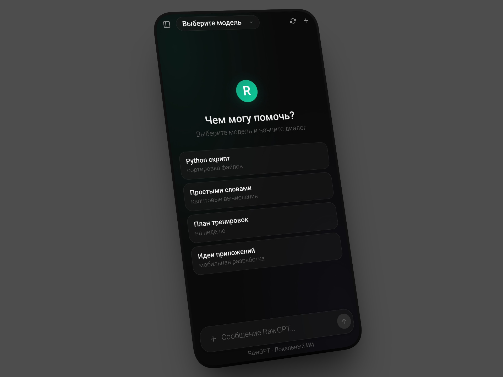

# RawGPT Mobile

<div align="center">


**Мобильный клиент для Ollama — локальный ИИ у тебя в кармане**

[](../../releases)
[](../../releases)
[](LICENSE)

[Скачать APK](https://github.com/rawneko/RawGPT-android/releases) · [Десктопная версия](https://github.com/rawnekoo/RawGPT)

</div>

---

## О проекте

RawGPT Mobile — мобильная версия [RawGPT](https://github.com/rawneko/RawGPT) для Android. Подключается к Ollama на вашем компьютере через локальную сеть. Полностью приватно — данные не покидают вашу сеть.

## Возможности

| Функция | Описание |
|---------|----------|
| **Чат** | Диалог с любой моделью Ollama |
| **Streaming** | Ответы в реальном времени |
| **Файлы** | Отправка текстовых файлов с UTF-8 |
| **Изображения** | Отправка картинок в Vision-модели |
| **3 темы** | Тёмная, Светлая, AMOLED |
| **Автодетект** | Определение Vision, Think, Tools, Code |
| **Поиск** | Поиск по истории чатов |
| **Офлайн история** | Локальное хранение на устройстве |
| **Перегенерация** | Повторная генерация ответа |
| **Копирование** | Копирование кода и сообщений |
| **Приватность** | Данные только в вашей сети |

## 📱 Скриншот:



## 📦 Установка

### Быстрый старт

1. Скачайте APK из [Releases](https://github.com/rawneko/RawGPT-android/releases)
2. Установите на Android
3. Укажите IP компьютера с Ollama в настройках

### Настройка Ollama на компьютере

На компьютере где работает Ollama установите переменные окружения:

**Windows** (PowerShell от администратора):
```powershell
[System.Environment]::SetEnvironmentVariable("OLLAMA_HOST", "0.0.0.0:11434", "User")
[System.Environment]::SetEnvironmentVariable("OLLAMA_ORIGINS", "*", "User")
```

**Linux/MacOS** 
```bash
export OLLAMA_HOST=0.0.0.0:11434
export OLLAMA_ORIGINS=*
```

Перезапустите Ollama после применения изменений.

## **В приложении:**

Откройте настройки -> введите URL.

```text
http://ВАШ_IP:11434
```

Нажмите "Тест" для проверки.

## **Требования:**

* Android 7+
* Компьютер с [Ollama](https://ollama.com)
* Одна WiFI / локальная сеть
